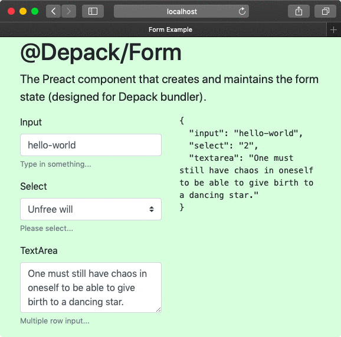

# @depack/form

[](https://npmjs.org/package/@depack/form)

`@depack/form` is The Bootstrap Form Component For Entering Data.



```sh
yarn add -E @depack/form
```

## Table Of Contents

- [Table Of Contents](#table-of-contents)
- [API](#api)
- [**Form**](#form)
- [**FormGroup**](#formgroup)
- [**Input**](#input)
- [Copyright](#copyright)

<p align="center"><a href="#table-of-contents"></a></p>

## API

The package is available by importing its default and named functions:

```js
import Form, {
  FormGroup, Input, TextArea, Select,
} from '@depack/form'
```

<p align="center"><a href="#table-of-contents"></a></p>

## **Form**

Creates the form that maintains the values of each field that is found inside its children. Any additional properties will be passed down to the form. Each child component will receive `values` in its context.

__<a name="type-formprops">`FormProps`</a>__: Options for the Form component.

|   Name   |    Type    |                                     Description                                     |
| -------- | ---------- | ----------------------------------------------------------------------------------- |
| onChange | _function_ | The callback to call when a change is made to any of the inputs inside of the form. |

```jsx
import Form, { FormGroup, TextArea, Input, Select } from '@depack/form'

const ExampleForm = ({ ...props }) => (<Form {...props}>
  <FormGroup label="Input" help="Type in something...">
    <Input name="input" value="hello-world" />
  </FormGroup>
  <FormGroup label="Select" help="Please select...">
    <Select name="select" value="2" options={[
      {
        title: 'Free will',
        value: '1',
      },
      {
        title: 'Unfree will',
        value: '2',
      },
    ]} />
  </FormGroup>
  <FormGroup label="TextArea" help="Multiple row input...">
    <TextArea name="textarea">
      One must still have chaos in oneself to be able to give birth to a dancing star.
    </TextArea>
  </FormGroup>
</Form>)

export default ExampleForm
```
```html
<form>
  <div class="form-group">
    <label htmlFor="i44672">
      Input
    </label>
    <input name="input" class="form-control" value="hello-world" type="text"
      aria-describedby="hi44672" id="i44672" />
    <small id="hi44672" class="form-text text-muted">
      Type in something...
    </small>
  </div>
  <div class="form-group">
    <label htmlFor="i42718">
      Select
    </label>
    <select name="select" value="2" class="custom-select" id="i42718"
      aria-describedby="hi42718">
      <option></option>
      <option value="1">
        Free will
      </option>
      <option value="2" selected="true">
        Unfree will
      </option>
    </select>
    <small id="hi42718" class="form-text text-muted">
      Please select...
    </small>
  </div>
  <div class="form-group">
    <label htmlFor="i47028">
      TextArea
    </label>
    <textarea name="textarea" aria-describedby="hi47028" class="form-control" id="i47028" rows="3">One must still have chaos in oneself to be able to give birth to a dancing star.</textarea>
    <small id="hi47028" class="form-text text-muted">
      Multiple row input...
    </small>
  </div>
</form>
```

<p align="center"><a href="#table-of-contents"></a></p>

## **FormGroup**

The form group is used to represent a logical combination of a label, input, help text and validation error message. The _FormGroup_ component generates `id` and `hid` values and passes them to children components in the context.

__<a name="type-formgroupprops">`FormGroupProps`</a>__

| Name  |   Type   |                                    Description                                    |
| ----- | -------- | --------------------------------------------------------------------------------- |
| label | _string_ | The label to display for the group.                                               |
| help  | _string_ | The help text to show in `<small className="form-text text-muted">{help}</small>` |

```jsx
import Form, { FormGroup, Input } from '@depack/form'

const Example = () => (
  <Form>
    <FormGroup
      label="What is your name?"
      help="Your name, your name, what is your name?"
    >
      <Input />
    </FormGroup>
  </Form>
)
```
```html
<form>
  <div class="form-group">
    <label htmlFor="i496">
      What is your name?
    </label>
    <input class="form-control" type="text" aria-describedby="hi496" id="i496" />
    <small id="hi496" class="form-text text-muted">
      Your name, your name, what is your name?
    </small>
  </div>
</form>
```

<p align="center"><a href="#table-of-contents"></a></p>

## **Input**

The input is a one-line entry field.

__<a name="type-inputprops">`InputProps`</a>__: Options for the Input component.

|    Name     |   Type    |            Description            |
| ----------- | --------- | --------------------------------- |
| required    | _boolean_ | Whether this is a required field. |
| name        | _string_  | The input name.                   |
| placeholder | _string_  | The input placeholder.            |
| value       | _string_  | The initial value.                |
| type        | _string_  | The input type.                   |

```jsx
import { Input } from '@depack/form'

const Example = () => (
  <Input
    name="example"
    placeholder="enter the value..."
    value="initial value"
    type="text"
    required
  />
)
```
```html
<input required="1" name="example" placeholder="enter the value..."
  class="form-control" value="initial value" type="text" />
```

<p align="center"><a href="#table-of-contents"></a></p>

## Copyright

<table>
  <tr>
    <th>
      <a href="https://artd.eco">
        
      </a>
    </th>
    <th>
      © <a href="https://artd.eco">Art Deco</a> for <a href="https://artd.eco/depack">Depack</a>
      2019
    </th>
    <th>
      <a href="https://www.technation.sucks" title="Tech Nation Visa">
        
      </a>
    </th>
    <th>
      <a href="https://www.technation.sucks">Tech Nation Visa Sucks</a>
    </th>
  </tr>
</table>

<p align="center"><a href="#table-of-contents"></a></p>