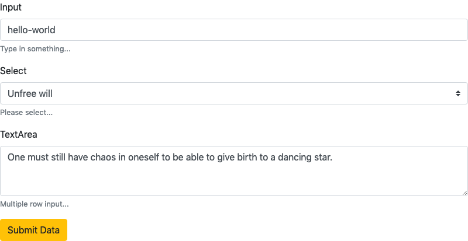

# @depack/form

[](https://npmjs.org/package/@depack/form)

`@depack/form` is The Bootstrap Form Component For Entering Data.

<a alt="Depack Demo" href="https://dpck.github.io/form/"></a>
<br><a alt="Depack Demo" href="https://dpck.github.io/form/">Click For The Demo</a>

```sh
yarn add -E @depack/form
```

## Table Of Contents

- [Table Of Contents](#table-of-contents)
- [API](#api)
  * [**Form**](#form)
  * [**FormGroup**](#formgroup)
  * [**Input**](#input)
  * [**Select**](#select)
  * [**Textarea**](#textarea)
  * [**SubmitForm**](#submitform)
    * [`reset(): void`](#reset-void)
- [Custom Components](#custom-components)
- [Copyright](#copyright)

<p align="center"><a href="#table-of-contents"></a></p>

## API

The package is available by importing its default and named functions:

```js
import Form, {
  FormGroup, Input, TextArea, Select,
} from '@depack/form'
```

<p align="center"><a href="#table-of-contents"></a></p>

### **Form**

Creates the form that maintains the values of each field that is found inside its children. Any additional properties will be passed down to the form. Each child component will receive `values` in its context.

__<a name="type-formprops">`FormProps`</a>__: Options for the Form component.

|   Name   |    Type    |                                     Description                                     |
| -------- | ---------- | ----------------------------------------------------------------------------------- |
| onChange | _function_ | The callback to call when a change is made to any of the inputs inside of the form. |
| formRef  | _function_ | The function to call with the reference to the form HTML.                           |
| onSubmit | _function_ | The function to call on form submit.                                                |

```jsx
import Form, { FormGroup, TextArea, Input, Select } from '@depack/form'

const ExampleForm = ({ ...props }) => (<Form {...props}>
  <FormGroup label="Input" help="Type in something...">
    <Input name="input" value="hello-world" />
  </FormGroup>
  <FormGroup label="Select" help="Please select...">
    <Select name="select" value="2" options={[
      {
        title: 'Free will',
        value: '1',
      },
      {
        title: 'Unfree will',
        value: '2',
      },
    ]} />
  </FormGroup>
  <FormGroup label="TextArea" help="Multiple row input...">
    <TextArea name="textarea">
      One must still have chaos in oneself to be able to give birth to a dancing star.
    </TextArea>
  </FormGroup>
</Form>)

export default ExampleForm
```
```html
<form>
  <div class="form-group">
    <label for="i70984">Input</label>
    <input name="input" class="form-control" value="hello-world" type="text"
      aria-describedby="hi70984" id="i70984" />
    <small id="hi70984" class="form-text text-muted">Type in something...</small>
  </div>
  <div class="form-group">
    <label for="i97426">Select</label>
    <select name="select" value="2" class="custom-select" id="i97426"
      aria-describedby="hi97426">
      <option></option>
      <option value="1">Free will</option>
      <option value="2" selected>Unfree will</option>
    </select>
    <small id="hi97426" class="form-text text-muted">Please select...</small>
  </div>
  <div class="form-group">
    <label for="i20008">TextArea</label>
    <textarea name="textarea" aria-describedby="hi20008" class="form-control"
      id="i20008" rows="3">One must still have chaos in oneself to be able to give birth to a dancing star.</textarea>
    <small id="hi20008" class="form-text text-muted">Multiple row input...</small>
  </div>
</form>
```

<table>
        <tr><td>
        </td></tr>
      </table>

<p align="center"><a href="#table-of-contents"></a></p>

### **FormGroup**

The form group is used to represent a logical combination of a label, input, help text and validation error message. The _FormGroup_ component generates `id` and `hid` values and passes them to children components in the context.

__<a name="type-formgroupprops">`FormGroupProps`</a>__: Options for the FormGroup component.

| Name  |   Type   |                                    Description                                    |
| ----- | -------- | --------------------------------------------------------------------------------- |
| label | _string_ | The label to display for the group.                                               |
| help  | _string_ | The help text to show in `<small className="form-text text-muted">{help}</small>` |

```jsx
import Form, { FormGroup, Input } from '@depack/form'

const Example = () => (
  <Form>
    <FormGroup
      label="What is your name?"
      help="Your name, your name, what is your name?"
    >
      <Input />
    </FormGroup>
  </Form>
)
```
```html
<form>
  <div class="form-group">
    <label for="i70984">What is your name?</label>
    <input class="form-control" type="text" aria-describedby="hi70984" id="i70984" />
    <small id="hi70984" class="form-text text-muted">
      Your name, your name, what is your name?
    </small>
  </div>
</form>
```

<p align="center"><a href="#table-of-contents"></a></p>

### **Input**

The input is a one-line entry field.

__<a name="type-inputprops">`InputProps`</a>__: Options for the Input component.

|    Name     |   Type    |            Description            |
| ----------- | --------- | --------------------------------- |
| required    | _boolean_ | Whether this is a required field. |
| name        | _string_  | The input name.                   |
| placeholder | _string_  | The input placeholder.            |
| value       | _string_  | The initial value.                |
| type        | _string_  | The input type.                   |

```jsx
import { Input } from '@depack/form'

const Example = () => (
  <Input
    name="example"
    placeholder="enter the value..."
    value="initial value"
    type="text"
    required
  />
)
```
```html
<input required name="example" placeholder="enter the value..."
  class="form-control" value="initial value" type="text" />
```

<p align="center"><a href="#table-of-contents"></a></p>

### **Select**

This element present the values to select from.

__<a name="type-selectprops">`SelectProps`</a>__: Options for the Select component.

|   Name   |                   Type                   |                           Description                            |
| -------- | ---------------------------------------- | ---------------------------------------------------------------- |
| required | _boolean_                                | Whether this is a required field.                                |
| name     | _string_                                 | The select name.                                                 |
| value    | _string_                                 | The initial value.                                               |
| options  | _Array&lt;{value: *, title: string}&gt;_ | The array with options to render inside of the `select` element. |

```jsx
import { Select } from '@depack/form'

const Example = () => (
  <Select name="example" required value="1"
    options={[
      { value: 1, title: 'hello' },
      { value: 2, title: 'world' },
    ]}>
  </Select>
)
```
```html
<select name="example" value="1" required class="custom-select">
  <option></option>
  <option value="1" selected>hello</option>
  <option value="2">world</option>
</select>
```

<p align="center"><a href="#table-of-contents"></a></p>

### **Textarea**

The input field with multiple lines. The child of the component will set the initial value inside of the textarea.

__<a name="type-textareaprops">`TextAreaProps`</a>__: Options for the TextAreaProps component.

|    Name     |   Type    |               Description               | Default |
| ----------- | --------- | --------------------------------------- | ------- |
| required    | _boolean_ | Whether this is a required field.       | -       |
| name        | _string_  | The textarea name.                      | -       |
| placeholder | _string_  | The textarea placeholder.               | -       |
| rows        | _number_  | How many rows should the textarea have. | `3`     |

```jsx
import { TextArea } from '@depack/form'

const Example = () => (
  <TextArea name="example" rows="4" required
    placeholder="enter the multiline value...">
    Hello World
  </TextArea>
)
```
```html
<textarea required name="example" placeholder="enter the multiline value..."
  class="form-control" rows="4">Hello World</textarea>
```

<p align="center"><a href="#table-of-contents"></a></p>

### **SubmitForm**

This class extends the `Preact.Component` and implements the `submit` method which will send the data to the server and await for the response while setting the `formLoading` property of the state to `true`. The `error` and `success` properties will also be set upon the arrival of data. The `submitFinish` callback can be used to receive the result of the form submission. Components implementing this abstract class must implement their own render method.

__<a name="type-submitformprops">`SubmitFormProps`</a>__: Options for the SubmitForm component.

|     Name     |               Type                |                                    Description                                    |
| ------------ | --------------------------------- | --------------------------------------------------------------------------------- |
| __path*__    | _string_                          | The path where to send data.                                                      |
| submitFinish | _(result: *) =&gt; Promise&lt;*>_ | The callback after the data has been sent with possible response from the server. |
__<a name="type-submitformstate">`SubmitFormState`</a>__: The state structure for the SubmitForm.

|       Name       |   Type    |                    Description                    |
| ---------------- | --------- | ------------------------------------------------- |
| __formLoading*__ | _boolean_ | Whether the data has been sent for submission.    |
| __error*__       | _string_  | The error returned by the server.                 |
| __success*__     | _boolean_ | Whether the form has been submitted successfully. |

```jsx
import Form, { SubmitForm, Input } from '@depack/form'

class DataForm extends SubmitForm {
  render() {
    const { error, success, formLoading } = this.state
    return (<Form onSubmit={this.submit.bind(this)}>
      <Input name="example" />
      {error && `Error: ${error}`}
      {success && 'Success!'}
      <button type="submit" disabled={formLoading}>Submit</button>
    </Form>)
  }
}
const Example = () => (
  <DataForm path="/send-data" submitFinish={() => {
    console.log('hooray!')
  }} />
)
```
```html
<form><input name="example" class="form-control" type="text" /><button type="submit">Submit</button></form>
```

#### `reset(): void`

Resets the `error` and `success` properties of the form.


<p align="center"><a href="#table-of-contents"></a></p>

## Custom Components

To implement a custom component, one must write a class component that would report its initial value in `componentDidMount` method via the `onChange` method that it receives in the context. Overall, there are 4 properties that a component can receive in the context:

- `id`: If placed in the _FormGroup_, this will be set to the ID that the component should set on the input so that the label can focus on it on click.
- `hid`: If placed in the _FormGroup_, this will be set to auto-generated value for the help field.
- `values`: This is the overall values hash containing all the values of the fields in the form. It is set by the _Form_ parent component.
- `onChange`: This is the callback set by the _Form_ to report changes to the values of the component. It must also be fired after the component is mounted to set its initial model value in the form (i.e. update the `values` field).

The components are controlled which means their values are set via the model, and are contained in the `values` context property. Whenever an update is needed, the `onChange` method has to be fired. To allow server-side rendering of the component when the initial value is not going to be reported to the _Form_ via the `componentDidMount`, it must be set manually after checking if `values` contain the name of the component. If the component for some reason is going to be used also outside of the form, the `values` must be defaulted to `{}`.

Here is an example of the _Input_ component which accounts for all the above points:

```jsx
import { Component } from 'preact'

export default class Input extends Component {
  constructor() {
    super()
    /**
     * @type {InputProps}
     */
    this.props = this.props
  }
  shouldComponentUpdate(_, __, newContext) {
    const { name } = this.props
    return this.context.values[name] != newContext.values[name]
  }
  componentDidMount() {
    const { value, name } = this.props
    const { onChange } = this.context
    if (value !== undefined) onChange(name, value)
  }
  render({
    required, name, placeholder, type = 'text', file, value,
  }) {
    const { onChange, hid, id, values = {} } = this.context
    const rendered = name in values // for SSR
    return <input
      required={required}
      name={name}
      placeholder={placeholder}
      className={`form-control${file ? '-file' : ''}`}
      value={rendered ? values[name] : value}
      type={type}
      aria-describedby={hid}
      id={id}
      onChange={(e) => {
        onChange(name, e.currentTarget.value)
      }}
    />
  }
}

/* documentary types/input.xml */
/**
 * @typedef {Object} InputProps Options for the Input component.
 * @prop {boolean} [required] Whether this is a required field.
 * @prop {string} [name] The input name.
 * @prop {string} [placeholder] The input placeholder.
 * @prop {string} [value] The initial value.
 * @prop {string} [type] The input type.
 */
```

<p align="center"><a href="#table-of-contents"></a></p>

## Copyright

<table>
  <tr>
    <th>
      <a href="https://artd.eco">
        
      </a>
    </th>
    <th>
      © <a href="https://artd.eco">Art Deco</a> for <a href="https://artd.eco/depack">Depack</a>
      2019
    </th>
    <th>
      <a href="https://www.technation.sucks" title="Tech Nation Visa">
        
      </a>
    </th>
    <th>
      <a href="https://www.technation.sucks">Tech Nation Visa Sucks</a>
    </th>
  </tr>
</table>

<p align="center"><a href="#table-of-contents"></a></p>